## Hi there, I'm Daniel Gonzalez👋

---
I'm an electrical engineer👷. Passionate about freaking with hardware, I always have a raspberry or an arduino on my desktop ⚙, I made my desktop and built my room by myself 🛠.

I love software development, I consider myself a software engineer 🤓. I always try to maintain a good equilibrium between the code quality ✔, application performance, 📈  and the "time to market"⌚.

I don't play any instrument but I love music, I listen to all genres but mainly rock  and vallenato .

#### I'm from medellin colombia papa!

- Python + Django + Docker + AWS = ♥ 

---

### 📫 I'm not active, but connect with me:
[][twitter] 
[][linkedin] 

---
### 💥Top Languages:
*NOTE: Top Languages does not indicate my skill level or anything like that, it's a GitHub metric of which languages have the most code on GitHub. It's generated daily by a GitHub Action.*

---
### :zap: GitHub Stats:  
  

       
  

 

[twitter]: https://x.com/DanielGzlzVll
[linkedin]: https://www.linkedin.com/in/daniel-gonzalez-2a326417a/
