## Hi there, I'm Daniel Gonzalez 👋

---

I'm an electrical engineer 👷. Passionate about tinkering with hardware, I always have a Raspberry Pi, an Arduino or an ESP32 on my desk ⚙. I built my desk and my room by myself 🛠, and these days I design and 3D-print a lot of my own parts 🖨.

I love software development and consider myself a software engineer 🤓. I always try to keep a good balance between code quality ✔, application performance 📈 and "time to market" ⌚.

I don't play any instrument but I love music. I listen to all genres, but mainly rock  and vallenato .

#### I'm from Medellín, Colombia, papá!

---

### 🔧 Currently tinkering with

- ESP32 sensors and dashboards in Grafana 📡
- Parametric CAD in OpenSCAD and 3D printing 🖨
- Tools for working with AI coding agents 🤖

### 🧰 Tech I use

- **Software:** Python · Django · Docker · AWS · PostgreSQL
- **Hardware:** ESP32 · Arduino · Raspberry Pi · C++
- **Making:** OpenSCAD · 3D printing

---

### 📌 Featured projects

---

### 💥 Top languages

*Note: this doesn't show my skill level. It's a GitHub metric of which languages have the most code in my repos, generated daily by a GitHub Action.*

### ⚡ GitHub stats

---

### 📫 Find me on

